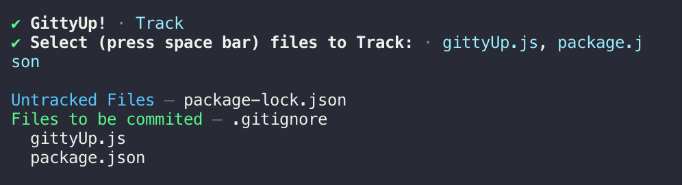

## gittyUp - Pretty git

A prettier git CLI using [simple-git](https://www.npmjs.com/package/simple-git), [enquirer](https://github.com/enquirer/enquirer#multiselect-prompt) and [purpzielog](https://github.com/Purpzie/log). I decided to make this because the git CLI on its own is not that pretty to look at (in my opinion).

### Menu

### Status

### Track

### Staged files

#### To do
- Check for modified files
- Implement commit support
- Unstage files
- Make a verbose mode for newbies explaining what commands are doing in the background??....